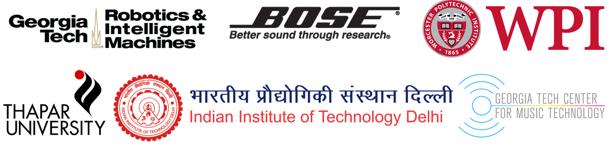

About Me
------

<ul>
  <li>I'm a Ph.D. student in the <a href="https://www.wpi.edu/academics/study/robotics-engineering-phd">Robotics Engineering</a> program at Worcester Polytechnic Institute. I'm a research assistant in <a href="https://medicalfusionlab.wordpress.com/">Medical FUSION Lab</a> guided by <a href="https://www.wpi.edu/people/faculty/hzhang10">Dr. Haichong Zhang</a>.</li>
  <li>My research is based on ultrasound image processing using machine learning. I am specifically interested in utilizing deep learning for image classification and real-time prediction with applications in domains ranging from disease diagnosis, rehabilitation robotics, robot assisted surgery, robotic teleoperation and gaming. I'm also very interested in utilizing Computer Vision and Augmented/Virtual Reality in my research. </li>
  <li>Prior to joining WPI, I worked as an Active Noise Control Engineering intern for <a href="https://automotive.bose.com/">Bose</a> (Automotive Systems Division) and an Audio DSP Engineer for Panasonic Automotive. I graduated <a href="https://www.news.gatech.edu/2018/11/06/getting-know-georgia-tech-keshav-bimbraw"> Georgia Tech </a> with a Master's in<a href="https://gtcmt.gatech.edu/robotic-musicianship"> Music Technology</a> in Spring 2019. I have worked as a research intern at IIT Delhi & I have a B.Tech. in <a href="http://www.thapar.edu/programmes/pages/btech-in-mechatronics"> Mechatronics Engineering</a> from Thapar University.</li>
</ul>

  
News
------

<ul>
  <li>August, 2020 - Started Ph.D. in Robotics Engineering at WPI!</li>
  <li>July, 2020 - Paper titled 'Augmented Reality-Based Lung Ultrasound Scanning Guidance' accepted with great reviews at MICCAI ASMUS 2020!</li>
  <li>April, 2020 - Paper titled 'Towards Sonomyography-Based Real-Time Control of Powered Prosthesis Grasp Synergies' accepted in EMBC 2020!</li>
  <li>March, 2020 - Accepted the offer for the position of research coordinator at WPI!</li>
  <li>October, 2019 - Started working as an Audio DSP Engineer at Panasonic Automotive.</li>
  <li>May, 2019 - Started working as an Active Noise Control Engineering Intern at Bose.</li>...
  <li>April, 2019 - Presented 'Sonomyography based real-time hand grasp configuration identification via supervised learning to control a soft robotic gripper' at ISMR/SSMR 2019.</li>
  <li>January, 2019 - Selected for Georgia Tech's Diversity and Inclusion Fellowship Program!</li>
  <li>December, 2018 - Presented 'Imparting Expressivity and Dynamics to Percussive Musical Robot Shimon' at Georgia Tech's 3 Minute Thesis 2018.</li>
  <li>October, 2018 - Presented 'Comparison and Integration of SMG and EMG' at BMES Annual Meeting 2018.</li>
  <li>July, 2018 - Selected for Georgia Tech's Accessibility, Rehabilitation, and Movement Science: An Interdisciplinary Traineeship Program in Human-Centered Robotics.</li><button onclick="myFunction()" id="myBtn">Read more</button>
</ul>

Previous Affiliations
------

Videos
------
<iframe src="https://player.vimeo.com/video/174093155" width="640" height="360" frameborder="0" allow="autoplay; fullscreen" allowfullscreen></iframe>

<a href="https://vimeo.com/174093155">
Collaborative Industrial Robotic arms playing Stringed Musical Instruments</a><a href="https://vimeo.com/user52996313"> on <a href="https://vimeo.com">Vimeo</a>.

<iframe src="https://player.vimeo.com/video/444132536" width="640" height="362" frameborder="0" allow="autoplay; fullscreen" allowfullscreen></iframe>

<a href="https://vimeo.com/444132536">Playing Sitar with a Robotic Marimba</a> from <a href="https://vimeo.com/user52996313">Keshav Bimbraw</a> on <a href="https://vimeo.com">Vimeo</a>.

